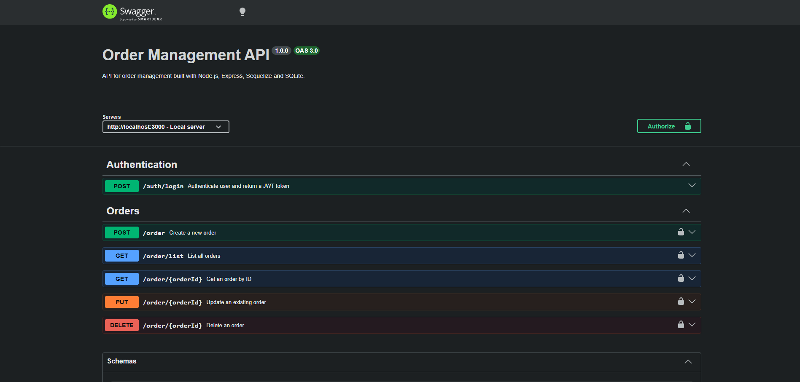
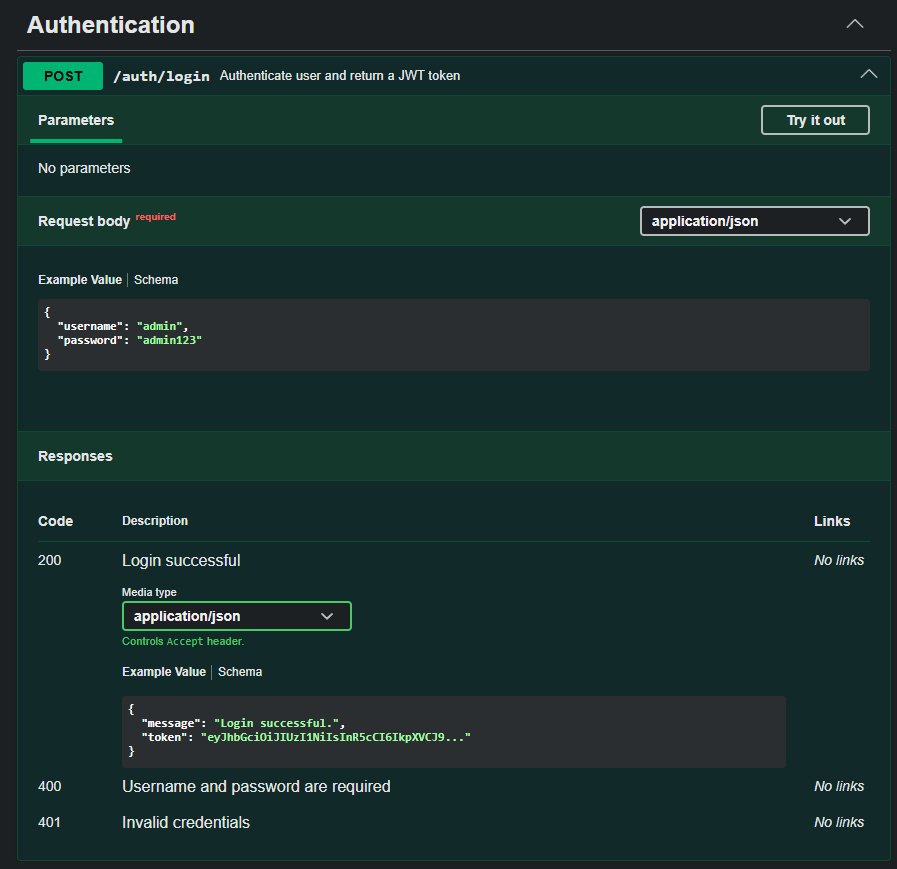
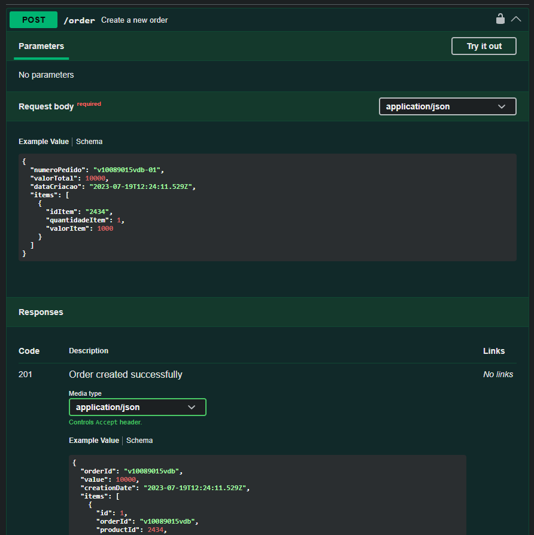
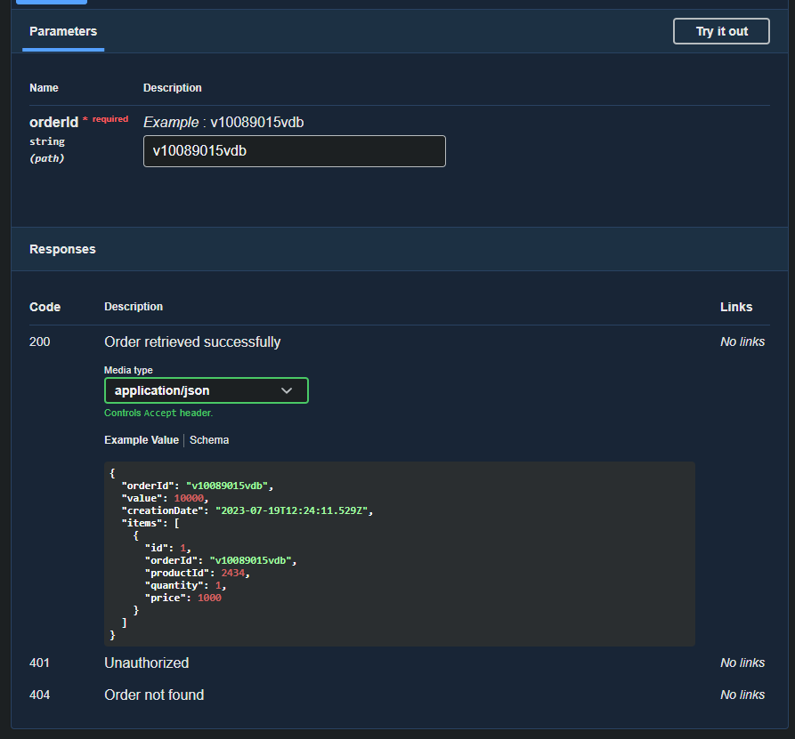
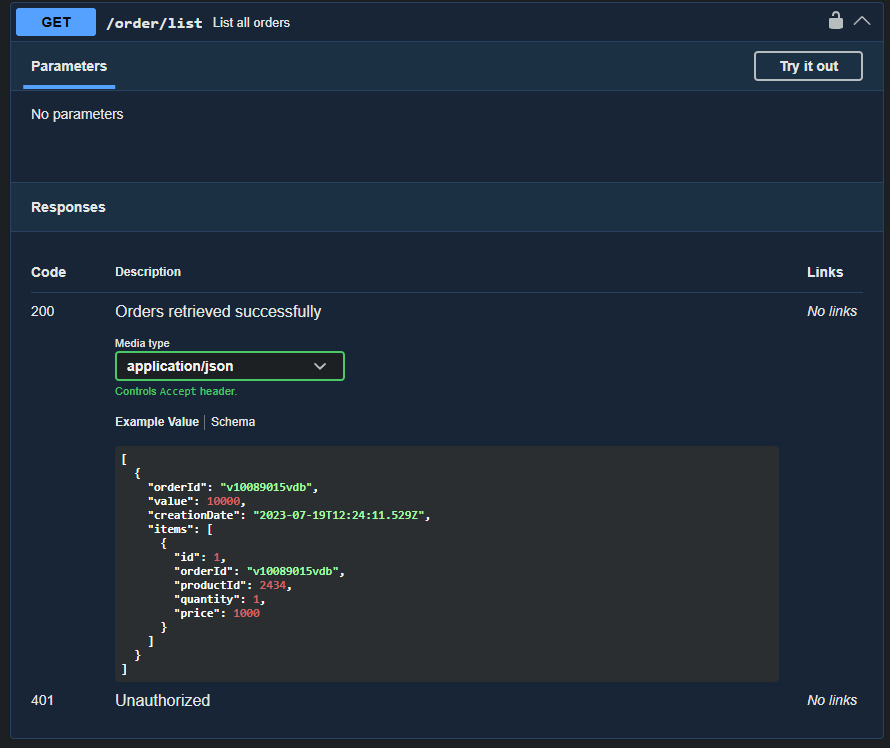
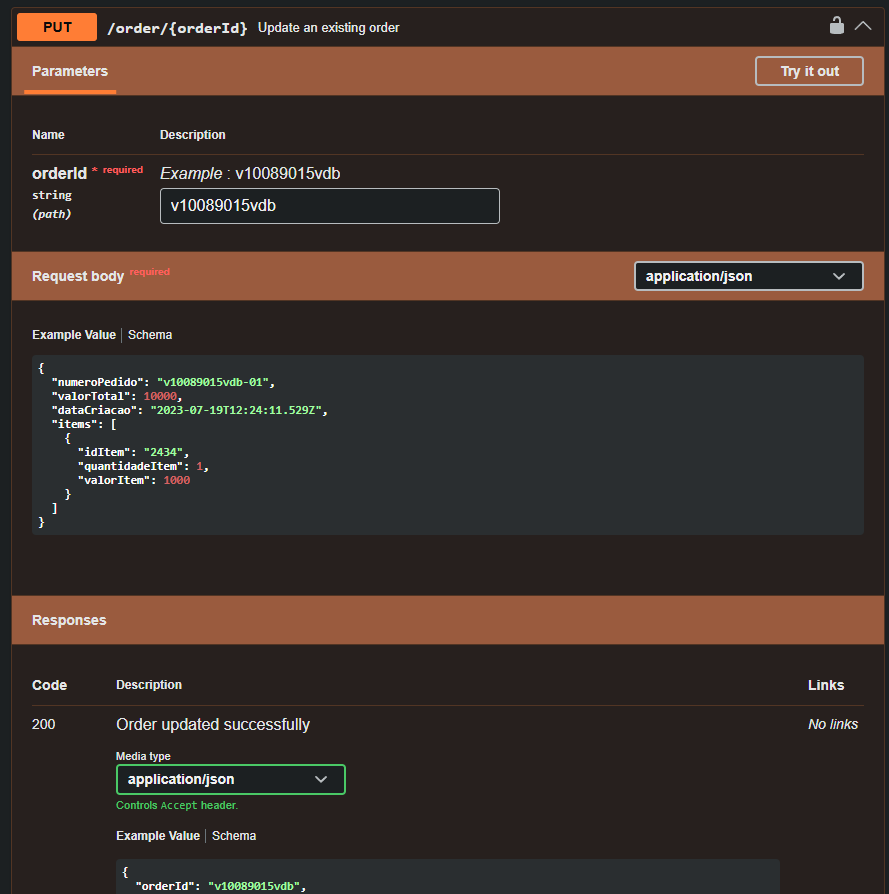
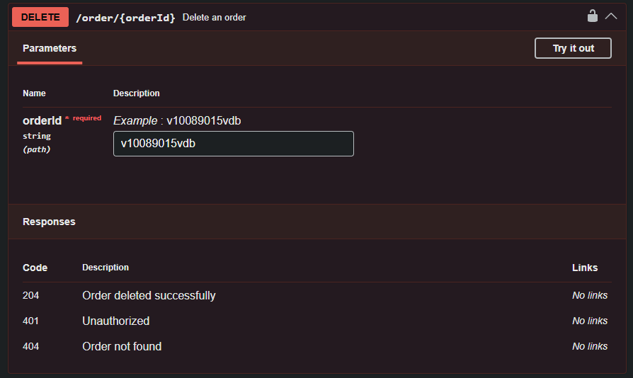
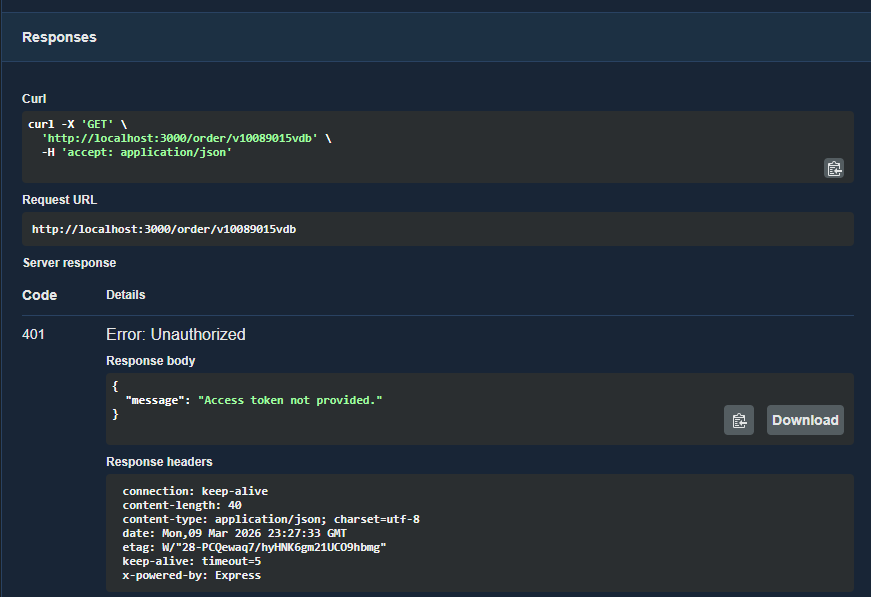

<h1 align="center">Order Management API</h1>

<p align="center">
  RESTful API for order management built with Node.js, Express, Sequelize, SQLite, JWT authentication, and Swagger documentation.
</p>

<p align="center">
  <a href="#about">About</a>&nbsp;&nbsp;|&nbsp;&nbsp;
  <a href="#workflow">Workflow</a>&nbsp;&nbsp;|&nbsp;&nbsp;
  <a href="#technologies">Technologies</a>&nbsp;&nbsp;|&nbsp;&nbsp;
  <a href="#features">Features</a>&nbsp;&nbsp;|&nbsp;&nbsp;
  <a href="#project-structure">Project Structure</a>&nbsp;&nbsp;|&nbsp;&nbsp;
  <a href="#authentication">Authentication</a>&nbsp;&nbsp;|&nbsp;&nbsp;
  <a href="#api-endpoints">API Endpoints</a>&nbsp;&nbsp;|&nbsp;&nbsp;
  <a href="#screenshots">Screenshots</a>
</p>

<p align="center">
  
  
  
  
  
  
  
  
  
</p>

---

## About

Order Management API is a backend application designed to manage orders and their related items through a complete RESTful interface.

The project was built with a layered architecture focused on maintainability, clear separation of responsibilities, and scalability. It includes request validation, payload transformation, SQL data persistence, protected routes with JWT, and interactive API documentation with Swagger.

This application supports the full order lifecycle, from creation to deletion, while also handling authentication and structured API responses.

---

## Workflow

This project was developed following an organized delivery flow using **SCRUM practices** and **Jira-based task management**.

The development process included:

- task breakdown into epics, tasks, and subtasks
- incremental implementation by feature
- organized Git history with task-based commits
- pull request flow for feature delivery and review
- clear separation between setup, business logic, endpoints, authentication, and documentation

This approach helped keep the implementation modular, trackable, and easy to maintain.

---

## Technologies

<p align="left">
  
  
  
  
  
  
  
  
  
</p>

### Main stack

- **Node.js**
- **Express**
- **JavaScript**
- **Sequelize**
- **SQLite**
- **JWT**
- **Swagger**
- **Joi**
- **Git & GitHub**
- **Jira**
- **SCRUM**

---

## Features

- Create a new order
- Get an order by ID
- List all orders
- Update an existing order
- Delete an order
- Validate incoming request payloads
- Transform request payloads into the internal persistence structure
- Protect order routes with JWT authentication
- Generate interactive API documentation with Swagger
- Use a modular architecture with controllers, services, models, middlewares, and utilities

---

## Architecture Highlights

This project follows a layered architecture to keep responsibilities well separated:

- **Routes** handle endpoint definitions
- **Controllers** manage request and response flow
- **Services** centralize business logic
- **Models** define database entities and relationships
- **Middlewares** handle validation, authentication, and errors
- **Utils** provide reusable transformation logic
- **Config** stores environment and integration setup

---

## Project Structure

```bash
src/
  config/
    database.js
    swagger.js
  controllers/
    authController.js
    orderController.js
  middlewares/
    authenticateToken.js
    errorHandler.js
    validateOrder.js
  models/
    index.js
    Item.js
    Order.js
  routes/
    authRoutes.js
    orderRoutes.js
  services/
    orderService.js
  utils/
    orderMapper.js
  app.js
  server.js
```

## Authentication

This API uses **JWT authentication** for order management endpoints.

### Login endpoint

```http
POST /auth/login
```

### Request body

```json
{
  "username": "admin",
  "password": "admin123"
}
```

### Success response

```json
{
  "message": "Login successful.",
  "token": "your_jwt_token"
}
```

### Using the token

After authenticating, send the token in the `Authorization` header using the Bearer format:

```http
Authorization: Bearer your_jwt_token
```

### Protected routes

The following routes require authentication:

- `POST /order`
- `GET /order/list`
- `GET /order/:orderId`
- `PUT /order/:orderId`
- `DELETE /order/:orderId`

---

## API Endpoints

### Authentication
- `POST /auth/login`

### Orders
- `POST /order`
- `GET /order/list`
- `GET /order/:orderId`
- `PUT /order/:orderId`
- `DELETE /order/:orderId`

---

## Request Example

### Create or update order

```json
{
  "numeroPedido": "v10089015vdb-01",
  "valorTotal": 10000,
  "dataCriacao": "2023-07-19T12:24:11.5299601+00:00",
  "items": [
    {
      "idItem": "2434",
      "quantidadeItem": 1,
      "valorItem": 1000
    }
  ]
}
```

---

## Payload Transformation

Before persistence, the incoming payload is transformed into the internal structure used by the database.

### Input payload

```json
{
  "numeroPedido": "v10089015vdb-01",
  "valorTotal": 10000,
  "dataCriacao": "2023-07-19T12:24:11.5299601+00:00",
  "items": [
    {
      "idItem": "2434",
      "quantidadeItem": 1,
      "valorItem": 1000
    }
  ]
}
```

### Stored structure

```json
{
  "orderId": "v10089015vdb",
  "value": 10000,
  "creationDate": "2023-07-19T12:24:11.529Z",
  "items": [
    {
      "orderId": "v10089015vdb",
      "productId": 2434,
      "quantity": 1,
      "price": 1000
    }
  ]
}
```

---

## Swagger Documentation

Interactive API documentation is available at:

```bash
http://localhost:3000/api-docs
```

Swagger can be used to:

- inspect available endpoints
- test requests directly from the browser
- authenticate using JWT through the **Authorize** button
- validate request and response examples

---

## Response Codes

### Authentication
- `200 OK` — Login successful
- `400 Bad Request` — Missing credentials
- `401 Unauthorized` — Invalid credentials

### Orders
- `200 OK` — Request completed successfully
- `201 Created` — Order created successfully
- `204 No Content` — Order deleted successfully
- `400 Bad Request` — Validation error
- `401 Unauthorized` — Missing or invalid token
- `404 Not Found` — Order not found
- `409 Conflict` — Order already exists

---

## Screenshots

### Swagger overview


### Login endpoint


### Create order


### Get order by ID


### List orders


### Update order


### Delete order


### Protected route with JWT


---

## Future Improvements

- Add automated tests with Jest and Supertest
- Add Docker support
- Add database migrations and seeders
- Improve login flow with persisted users
- Add role-based authorization
- Add refresh token flow

---
